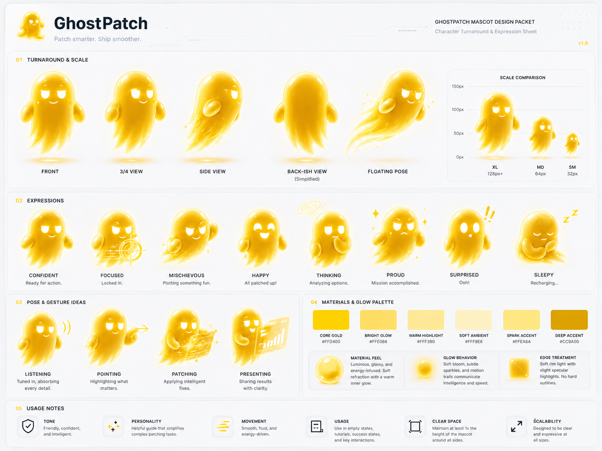

<div align="center">

# ✨ WispPatch

### Point at any website. Tell Wisp. Watch the design change.

**Wisp is a glowing design spirit that lives in your browser.** Click any section of a running site, say what you want, and Wisp flies over, scans it, and applies a live visual patch — then hands your coding agent everything it needs to make the change real.

[](LICENSE)
[](package.json)
[](package.json)
[](package.json)
[](#the-safety-model)

<br />


*Real session: click a section → Wisp flies in → live design pass → Lock It In.*

</div>

---

## Why WispPatch

Coding agents are great at writing code and famously mediocre at *seeing* design. WispPatch flips the loop:

- 🎯 **Design on the real page, not a mockup.** Click any element of any running website. Wisp applies a reversible visual patch right in the browser — no source edits, nothing breaks.
- 👻 **A mascot, not a menu.** Wisp flies to your click with a comet trail, scans the target with a holo-ring, blinks, watches your cursor, and presents results like a tiny manga hero. Design tools don't have to feel like tax software.
- 🤝 **Built for agent handoff.** One click exports before/after screenshots, the exact CSS operations, the page's captured design DNA, a critique scorecard, and an implementation prompt for Claude Code, Cursor, or Codex.
- 🔒 **100% local.** No login, no cloud, no telemetry, no hosted AI. Refresh the page and the patch is gone.

## Quick start

```bash
git clone https://github.com/ohad6k/WispPatch.git
cd WispPatch
npm install && npm run build

# try it on the bundled demo page
npm run demo                          # terminal 1
node dist/cli/index.js http://127.0.0.1:4177   # terminal 2
```

Or point it at anything you're running locally:

```bash
node dist/cli/index.js http://localhost:3000
```

Then:

1. **Click** the section you want to change.
2. **Tell Wisp** a goal — `Signature polish`, `CTA focus`, `dark mode`, `change Account notes to Account` — or type your own.
3. **React** with the manga buttons: `LOCK IT IN` ⭐ / `TRY AGAIN` ↻ / `PUSH FURTHER` ↗ / `UNDO` ↩.
4. **Hand off** — `Lock It In` writes a full proof package to `.wisppatch/latest`.

## How it works

```text
wisppatch <url>
  → opens Chromium via Playwright
  → injects Wisp into a Shadow DOM overlay (zero page pollution)
  → you click a real element on the page
  → Wisp reads the page's design DNA: colors, fonts, spacing, radii, real CTAs
  → applies a reversible, target-aware visual recipe
  → exports screenshots + machine-readable patch + agent prompt
```

Every design pass inspects the target first — existing layout, real button styles, media, density — so patches extend the product's own design system instead of pasting a generic AI look on top. Purple-gradient slop is detected and refused.

## The handoff package

`Lock It In` exports `.wisppatch/latest/` with everything an implementation agent needs:

| The essentials | |
| --- | --- |
| `before.png` / `after.png` | Visual proof of the approved direction. |
| `visualpatch.json` | Target selector, bounds, goal, and the exact CSS operations. |
| `implement.md` | Ready-to-paste prompt for your coding agent. |
| `review.html` | Local side-by-side review page. |

<details>
<summary><strong>…plus the full design contract (14 more files)</strong></summary>

| File | Purpose |
| --- | --- |
| `design-brief.md/json` | Wisp design contract: skill stack, workflow, critique rubric, completion gates. |
| `design-analysis.md/json` | Before/after target analysis: structure, density, assets, computed styles, risks. |
| `design-dna.md/json` | Page-level design DNA: colors, fonts, spacing, assets, framework hints. |
| `design-assets.md/json` | Real-assets-first registry with quality scores and honest-placeholder rules. |
| `design-system.md/json` | Reusable DESIGN.md-style token and anti-slop contract distilled from the page. |
| `design-iterations.md/json` | Loop history: attempts, retries, pushes, undos, accepted pass. |
| `design-directions.md/json` | Alternate direction map with target-aware implementation routes. |
| `design-critique.md/json` | Automatic preflight critique with scores, hard fails, and quick wins. |
| `design-verification.md/json` | Browser-verified proof: visibility, desktop/mobile overflow, critique pass. |
| `design-gate.md/json` | Pass/fail scorecard the implementing agent must complete. |

</details>

The exported prompt tells the next agent to read the captured design system, choose a justified direction, avoid generic AI patterns (card spam, purple-blue gradients, fake metrics), preserve app behavior, and verify the implementation against `after.png` in a real browser. Design feedback becomes rules, not vibes.

## Meet Wisp

<div align="center">



</div>

Wisp is a character with a job, not a cursor sticker:

| State | What you see |
| --- | --- |
| **Idle** | Soft bob, ambient sparkles, eyes that follow your cursor. |
| **Flying** | Squash-and-stretch comet with a golden particle trail. |
| **Scanning** | Hovers over the target with rippling holo-rings, eyes sweeping. |
| **Patching** | Spark bursts over the section as changes land. |
| **Presenting** | Floats beside a glowing result card, waiting for your verdict. |
| **Success** | Celebration bounce + star burst when you lock it in. |

The full brand kit — motion sheets, manga UI components, palette — lives in [`assets/`](assets) and is MIT-licensed with the code. Remix away.

## The safety model

WispPatch v0.1.0 is intentionally narrow:

- ✅ reversible browser-only patches — refresh and it's gone
- ✅ screenshots stay on your machine
- ❌ no login, cloud, database, or hosted AI provider
- ❌ no automatic source edits — durable changes go through *your* coding agent, with your review

## Commands

| Command | Description |
| --- | --- |
| `npm run build` | Build the CLI and injected overlay into `dist`. |
| `npm run demo` | Serve the local demo page at `http://127.0.0.1:4177`. |
| `npm run qa:demo` | Headless end-to-end check: select → patch → export → verify artifacts. |
| `npm run check` | Type-check the project. |
| `node dist/cli/index.js <url>` | Launch WispPatch against any page. |

## Roadmap

- [ ] Wisp emotion set: proud, thinking, sleepy, surprised
- [ ] Richer visual recipes and multi-target passes
- [ ] Side-by-side diff review UI
- [ ] MCP server so agents can drive Wisp directly
- [ ] Browser extension packaging
- [ ] Optional shareable review links

## Contributing

PRs welcome. Ground rules for v0.1.0: local-first, source-safe, reversible patches, and exported prompts stay scoped to the approved target. Before sending a change:

```bash
npm run check && npm run build && npm run qa:demo
```

WispPatch's own design contract lives in [DESIGN.md](DESIGN.md), and the agent workflow in [docs/design-workflow.md](docs/design-workflow.md).

## License

[MIT](LICENSE) — code, mascot, and brand kit.

---

<div align="center">

**If Wisp made you smile, [star the repo](https://github.com/ohad6k/WispPatch) ⭐ — it keeps the little ghost glowing.**

</div>
